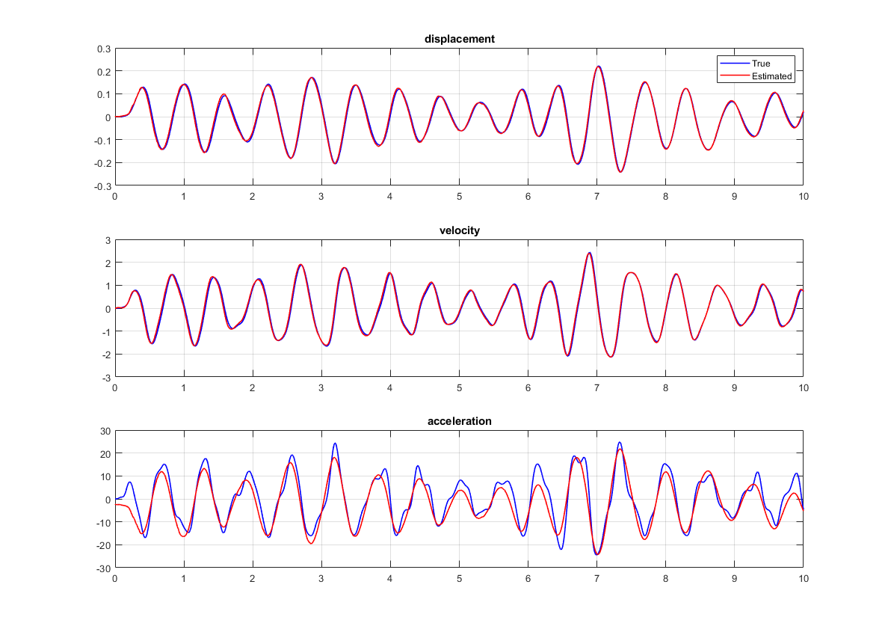

# Ensemble kalman filter

Kalman filter has been a popular choice to filter out the noise from the data and estimate the hidden state in real-time. It has been in use long before there was enough  computational resources available as it is takes only $O(N)$ computational time. More general detailed info can be refered from the readme file outside this folder. Here we will look into more detailed in Ensemble Kalman Filter.

Kalman Filter is applicable for only linear process equation and linear measurement equation i.e why there was need for modification in original kalman filter. One of the modified Kalman filter is Ensemble kalman filter. 

#### Process equation:
$$x_{t} = f(x_{t-1},u_{t-1})$$

#### Measurement equation:
$$y_{t} = g(x_t,u_t)$$

The $f()$ and $g()$ can be linear or nonlinear.

#### Predict/forecast step:
$$x^i_t = f(x^i_{t-1},u_{t-1})$$  

where $i$ corresponds to sample no.

$\bar{x}_t = 1/q \sum_{i=1}^{i=q} x^i_t$

$$E_{x_t} = [x^1_t-\bar{x}_t,....,x^q_t-\bar{x}_t ]$$

#### Update/ analysis step:
$$y^i_t = g(x^i_t,u_t)$$

[NOT YET COMPLETED]

# Result from matlab code

